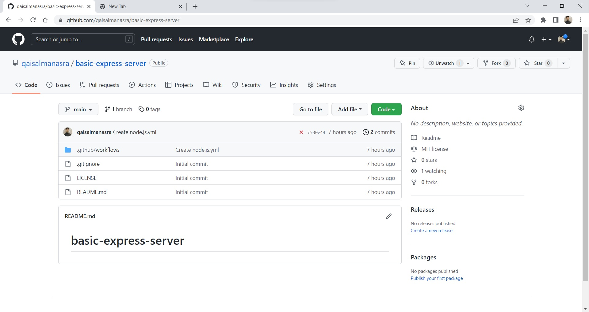
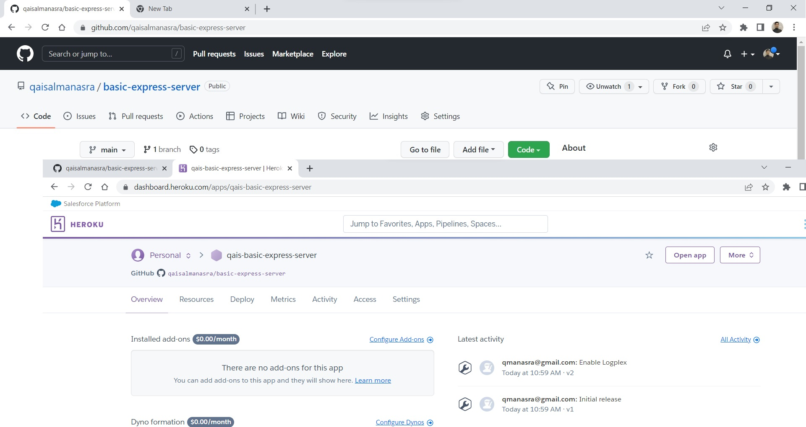
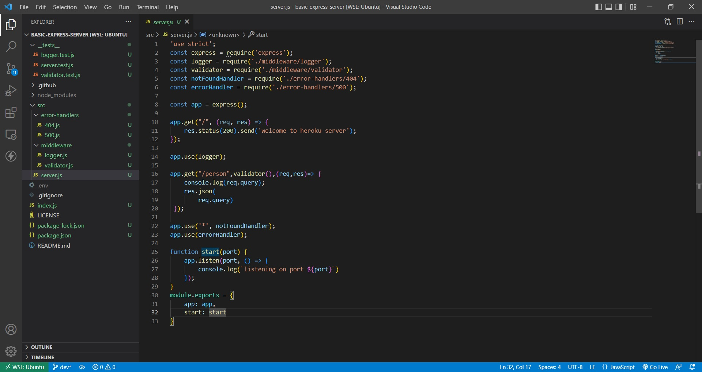
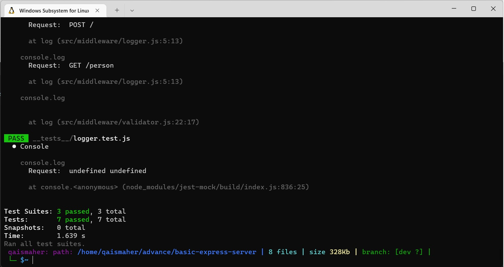
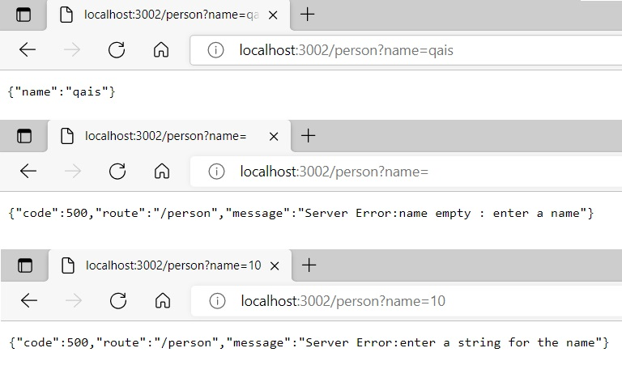

# basic-express-server
> ## **Instructor's notes**
- Making a repo with node ignore and MIT license.
- Make a yml file for the actions in github for 2 branches.
- Make heroku apps and connect it with repo's main branch github.
- Clone the repo in local machine.
- Install all needed packages.
- Build the server , deal with handlers and middlewares.
- Build a test for each feature and test it.
- Do an ACP.
>## **URL's**
#### [Heroku](https://qais-basic-express-server.herokuapp.com/)
#### [GitHub Actions](https://github.com/qaisalmanasra/basic-express-server/actions)
#### [GitHub PR](https://github.com/qaisalmanasra/basic-express-server/pulls)
>## **Drawing and notes**

